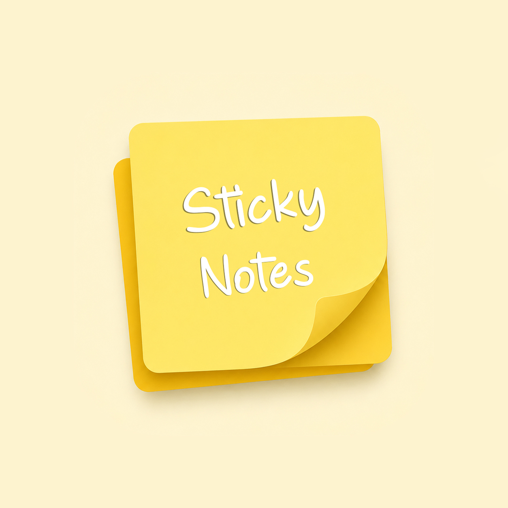
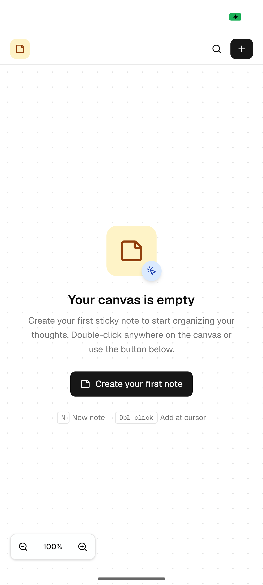
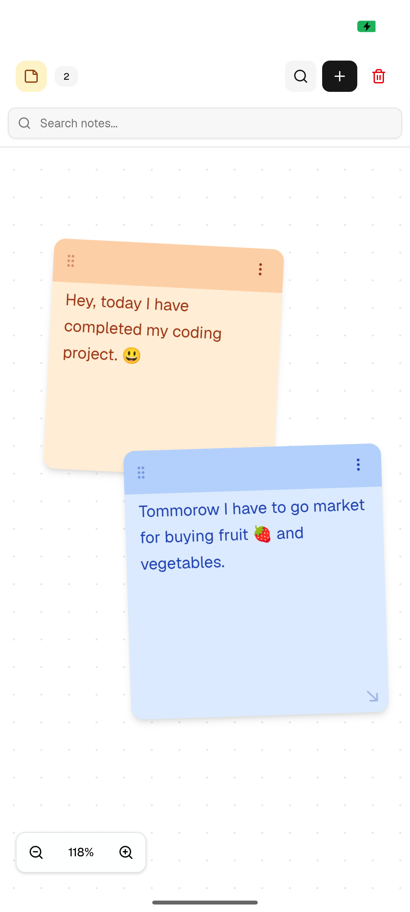
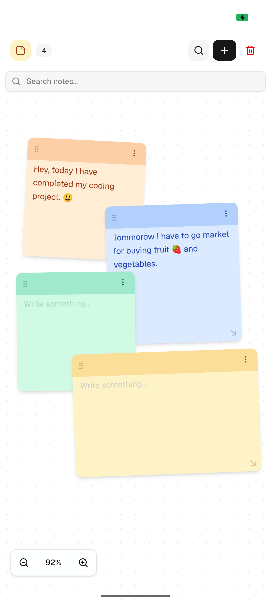
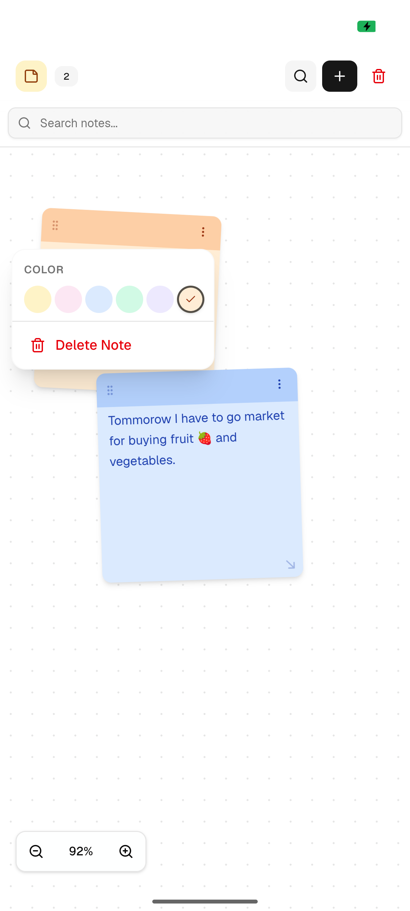
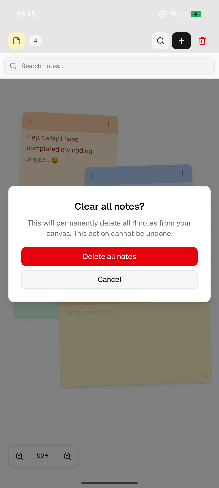

<div align="center">



# Sticky Notes

### A Beautiful, Freeform Digital Canvas for Your Thoughts

[](https://github.com/)
[](https://nextjs.org/)
[](https://github.com/)
[](https://github.com/)

<br/>

*Sticky Notes is a sleek, modern sticky notes application that lets you organize your thoughts on an infinite digital canvas. Drag, resize, color-code, and search — all with a buttery-smooth experience designed for mobile.*

<br/>

### 📥 Download

<a href="https://github.com/rahulloyal/Sticky-Notes---The-Digital-Canvas/releases/latest/download/Sticky-Notes.apk">
  
</a>

<br/>

<sub>📱 Android 8.0+ required • No ads • 100% offline</sub>

<br/><br/>

[Features](#-features) · [Screenshots](#-screenshots) · [Tech Stack](#-tech-stack) · [Architecture](#-architecture) · [Download](#-download) · [Developer](#-developer)

</div>

---

<br/>

## ✨ Features

<table>
<tr>
<td width="50%">

### 🎨 Rich Color Palette
Choose from **6 beautiful color themes** — Yellow, Pink, Blue, Green, Purple, and Orange — to categorize and personalize every note.

### 🔍 Real-Time Search
Instantly search through all your notes with **live filtering**. Matching notes are highlighted while others gracefully fade out.

### 📐 Drag & Resize
Freely **drag notes** anywhere on the infinite canvas. **Resize** them from the corner handle to fit any amount of content.

</td>
<td width="50%">

### 🔄 Pinch-to-Zoom
**Pinch to zoom** in and out of your canvas (25% → 200%). Dedicated zoom controls also available at the bottom-left corner.

### 💾 Persistent Storage
All notes are **saved automatically** to local storage. Your canvas is always there when you come back — no login required.

### ⌨️ Keyboard Shortcuts
Power-user shortcuts: **`N`** for new note, **`Ctrl+/- `** for zoom, **`Ctrl+0`** to reset zoom, and **double-click** to add a note at cursor.

</td>
</tr>
</table>

### More Features

| Feature | Description |
|---------|-------------|
| 🗑️ **Smart Delete** | Two-step delete confirmation prevents accidental data loss |
| 📋 **Board System** | Organize notes across named, renamable canvases |
| 🎯 **Context Menu** | Right-click anywhere to add a note at that exact position |
| 📱 **Mobile-First** | Designed with safe areas for notch displays & gesture navigation |
| ✏️ **Inline Editing** | Click any note to start typing — no modals, no friction |
| 🏷️ **Note Counter** | Live badge shows total note count in the toolbar |
| 🧲 **Z-Index Management** | Click a note to bring it to front — natural stacking behavior |
| 🎭 **Smooth Animations** | Micro-animations, hover effects, and transitions throughout |
| 📏 **Dot Grid Background** | Beautiful dot-pattern canvas that scales with zoom |
| 🌐 **Cross-Platform** | Runs as a web app and an Android APK via Capacitor |

<br/>

---

<br/>

## 📸 Screenshots

<div align="center">

### Empty Canvas • Getting Started



<br/><br/>

*Clean, minimal canvas with helpful onboarding — keyboard shortcuts & a call-to-action button to create your first note.*

<br/><br/>

### Notes on Canvas • Drag, Write, Organize

 &nbsp;&nbsp;&nbsp;&nbsp; 

<br/><br/>

*Multiple colored sticky notes freely placed on the canvas with drag handles, resize grips, and search bar.*

<br/><br/>

### Color Picker • Personalize Your Notes



<br/><br/>

*Beautiful popover menu with 6 color options and a delete action — keeping the interface clean and minimal.*

<br/><br/>

### Clear All • Safe Bulk Actions



<br/><br/>

*Confirmation dialog prevents accidental deletion — clear UI hierarchy with destructive action highlighted in red.*

</div>

<br/>

---

<br/>

## 🛠️ Tech Stack

<div align="center">

| Layer | Technology | Purpose |
|-------|-----------|---------|
| **Framework** |  | React framework with App Router |
| **Language** |  | Type-safe development |
| **UI Library** |  | Component-based UI |
| **Styling** |  | Utility-first CSS framework |
| **Components** |  | Accessible, headless UI primitives |
| **Icons** |  | Modern, consistent icon set |
| **Native** |  | Web → Android bridge |
| **Notifications** |  | Beautiful toast notifications |
| **Analytics** |  | Performance & usage tracking |

</div>

<br/>

---

<br/>

## 🏗️ Architecture

```
📦 Sticky Notes
├── 🎯 app/              # Next.js App Router
│   ├── page.tsx          # Main entry — board initialization
│   ├── layout.tsx        # Root layout with theme provider
│   └── globals.css       # Global styles & design tokens
│
├── 🧩 components/        # React Components
│   ├── sticky-canvas.tsx # Infinite canvas with zoom & pan
│   ├── sticky-note.tsx   # Individual note with color & resize
│   ├── canvas-toolbar.tsx# Top bar with search, add, clear
│   ├── empty-canvas.tsx  # Onboarding empty state
│   ├── note-color-picker.tsx
│   └── ui/               # Radix-based UI primitives
│
├── 🪝 hooks/             # Custom React Hooks
│   ├── use-sticky-notes  # CRUD operations & search filtering
│   └── use-canvas-interactions # Drag & resize state machine
│
├── 📚 lib/               # Core Logic
│   ├── sticky-notes-storage.ts  # LocalStorage persistence
│   ├── sticky-notes-types.ts    # TypeScript interfaces
│   ├── note-colors.ts           # Color palette configuration
│   └── utils.ts                 # Utility functions
│
└── 📱 android/           # Capacitor Android Project
    └── ...               # Native Android build files
```

<br/>

---

<br/>

## 🎨 Design Philosophy

<div align="center">

> *"The best tool is the one that gets out of your way."*

</div>

<br/>

- **🎯 Zero Friction** — Double-click to create, click to edit. No buttons, modals, or forms standing between you and your thought.

- **🌊 Infinite Canvas** — No pages, no folders, no hierarchy. Just a wide-open space that grows with your ideas.

- **🎨 Tactile & Familiar** — Real sticky-note aesthetics with tape-strip headers, soft shadows, and subtle rotations make digital feel physical.

- **📱 Mobile-Native Feel** — Built for touch-first with safe area handling, pinch-to-zoom, and gesture-friendly interactions.

<br/>

---

<br/>

## 👨‍💻 Developer

<div align="center">

### Developed by

# **Rahul Loyal Dalmas**

<br/>

<a href="https://www.instagram.com/rahul_.loyal/" target="_blank">
  
</a>
&nbsp;&nbsp;
<a href="https://www.linkedin.com/in/rahul-loyal-dalmas-5baa4532b/" target="_blank">
  
</a>

<br/><br/>

---

<br/>

### Powered by


<br/><br/>

*Building beautiful, human-centered digital experiences.*

</div>

<br/>

---

<br/>

<div align="center">

### ⭐ If you like this project, give it a star!

<br/>

Made with ❤️ by **Rahul Loyal Dalmas** × **Shruhh.inc**

<br/>

© 2026 Shruhh.inc — All Rights Reserved.

</div>
